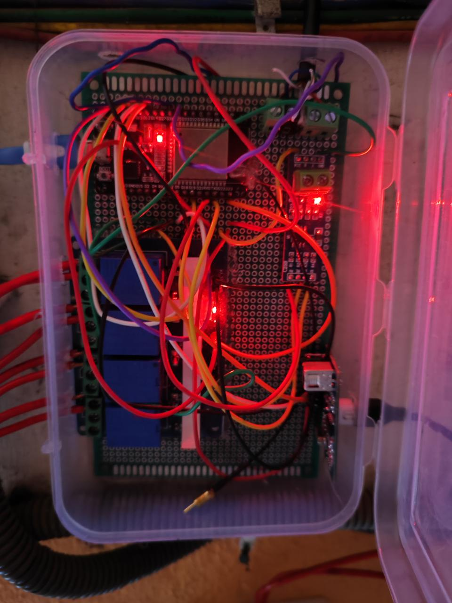

# Embedded-Pump-Control

This project is an embedded system for controlling a water pump based on the water levels in two tanks. It uses ultrasonic sensors to measure the water levels and a relay to control the pump. The system communicates via Bluetooth for monitoring and control.

## Features
- Monitors water levels in upper and lower tanks
- Automatically turns the pump on and off based on water levels
- Bluetooth communication for remote monitoring and control
- Displays system status and water levels

## Components
- ESP32 microcontroller
- Ultrasonic sensors (HC-SR04) for water level measurement
- Relay module for pump control
- Bluetooth module (integrated in ESP32)
- Connecting wires and breadboard

## Connections
- **Upper Tank Sensor:**
  - Trig Pin: GPIO 25
  - Echo Pin: GPIO 26
- **Lower Tank Sensor:**
  - Trig Pin: GPIO 12
  - Echo Pin: GPIO 13
- **Pump Relay:**
  - Control Pin: GPIO 23
- **Touch Pin:**
  - GPIO 4

## Setup Instructions
1. Connect the ultrasonic sensors to the ESP32 as per the connections mentioned above.
2. Connect the relay module to the ESP32 and the pump.
3. Upload the code to the ESP32 using the Arduino IDE.
4. Open the Serial Monitor to view the system status and water levels.
5. Use a Bluetooth terminal app to connect to the ESP32 and send commands.

## Usage
- The system will automatically monitor the water levels and control the pump.
- Send the command `stats` via Bluetooth to get the current status and water levels.

## Example Output
```
Upper tank water level is: 30.5
Lower tank water level is: 60.2
The pump is off
```

## Photo Example


## License
This project is licensed under the MIT License.